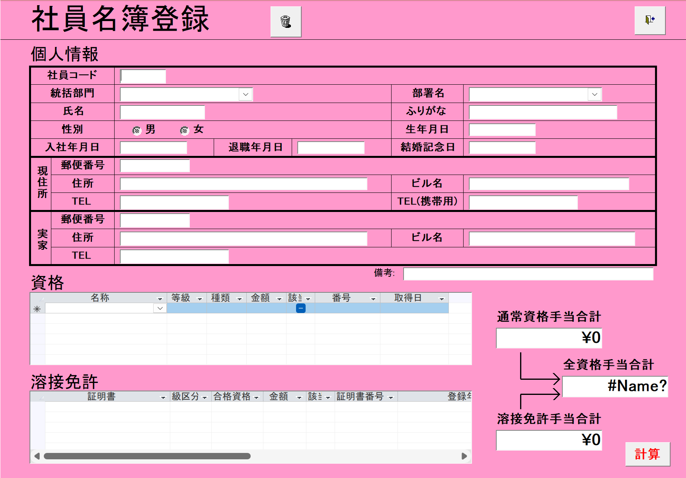

# Employee Registration Screen Specification
**Version:** v0.1  
**Last Updated:** 2025-10-25  
**Author:** Chính  
**Reviewer:** [PM/Leader Name]  
**System:** HR Management  

---

## 1. Overview
The **Employee Registration** screen (社員名簿登録) is used to input, edit and manage detailed employee information, including personal information, addresses, qualifications and welding licenses.

- **Screen endpoint:** `/employee/registration`
- **Background color:** Purple (#8B5CF6), main display area white

## Wireframe


---

## Screen Structure

### 1. Personal Information (個人情報)

#### 1.1. Basic Information
- **社員コード (Employee Code)**
  - **Type:** Text input
  - **Required:** Yes
  - **Description:** Unique identifier for the employee
  - **DB Mapping:** `T_社員マスタ.社員コード`

- **統括部門 (Controlling Division)**
  - **Type:** Dropdown
  - **Required:** Yes
  - **Description:** High-level management division
  - **DB Mapping:** `T_統括部門.統括部門` via `T_社員マスタ.部門名`

- **部署名 (Department Name)**
  - **Type:** Dropdown
  - **Required:** Yes
  - **Description:** Specific department name
  - **DB Mapping:** `T_部署名.部署名` via `T_社員マスタ.部署名`

- **氏名 (Full Name)**
  - **Type:** Text input
  - **Required:** Yes
  - **Description:** Employee's full name
  - **DB Mapping:** `T_社員マスタ.氏名`

- **ふりがな (Furigana)**
  - **Type:** Text input
  - **Required:** No
  - **Description:** Employee name in Hiragana/Katakana
  - **DB Mapping:** `T_社員マスタ.かな氏名`

- **性別 (Gender)**
  - **Type:** Radio button
  - **Options:** 男 (Male), 女 (Female)
  - **Required:** Yes
  - **DB Mapping:** `T_社員マスタ.性別`

- **生年月日 (Date of Birth)**
  - **Type:** Date picker
  - **Required:** Yes
  - **Description:** Employee's birth date
  - **DB Mapping:** `T_社員マスタ.生年月日`

- **入社年月日 (Hire Date)**
  - **Type:** Date picker
  - **Required:** Yes
  - **Description:** Employee's start date
  - **DB Mapping:** `T_社員マスタ.入社年月日`

- **退職年月日 (Resignation Date)**
  - **Type:** Date picker
  - **Required:** No
  - **Description:** Employee's resignation date
  - **DB Mapping:** `T_社員マスタ.退職年月日`

- **結婚記念日 (Wedding Anniversary)**
  - **Type:** Date picker
  - **Required:** No
  - **Description:** Employee's wedding anniversary
  - **DB Mapping:** `T_社員マスタ.結婚記念日`

#### 1.2. Current Address (現住所)
- **郵便番号 (Postal Code)**
  - **Type:** Text input
  - **DB Mapping:** `T_社員マスタ.郵便番号1`

- **住所 (Address)**
  - **Type:** Text input
  - **DB Mapping:** `T_社員マスタ.住所1`

- **ビル名 (Building Name)**
  - **Type:** Text input
  - **DB Mapping:** `T_社員マスタ.ビル名1`

- **TEL (Phone)**
  - **Type:** Text input
  - **DB Mapping:** `T_社員マスタ.TEL1`

- **TEL(携帯用) (Mobile Phone)**
  - **Type:** Text input
  - **DB Mapping:** `T_社員マスタ.TEL携帯用`

#### 1.3. Family Address (実家)
- **郵便番号 (Postal Code)**
  - **Type:** Text input
  - **DB Mapping:** `T_社員マスタ.郵便番号2`

- **住所 (Address)**
  - **Type:** Text input
  - **DB Mapping:** `T_社員マスタ.住所2`

- **ビル名 (Building Name)**
  - **Type:** Text input
  - **DB Mapping:** `T_社員マスタ.ビル名2`

- **TEL (Phone)**
  - **Type:** Text input
  - **DB Mapping:** `T_社員マスタ.TEL2`

#### 1.4. Remarks (備考)
- **Type:** Textarea
- **Description:** General remarks field
- **DB Mapping:** `T_社員マスタ.備考`

---

### 2. Qualifications (資格)

#### 2.1. Qualification Management Table
**Table Structure:**
- **名称 (Qualification Name)**
  - **Type:** Dropdown
  - **DB Mapping:** `T_資格手当.名称` via `T_資格.資格ID`

- **等級 (Grade)**
  - **Type:** Text display
  - **DB Mapping:** `T_資格手当.等級`

- **種類 (Type)**
  - **Type:** Text display
  - **DB Mapping:** `T_資格手当.種類`

- **金額 (Allowance Amount)**
  - **Type:** Number display
  - **DB Mapping:** `T_資格手当.金額`

- **該 (Apply)**
  - **Type:** Checkbox
  - **DB Mapping:** `T_資格.チェック`

- **番号 (Certificate Number)**
  - **Type:** Text input
  - **DB Mapping:** `T_資格.番号`

- **取得日 (Acquisition Date)**
  - **Type:** Date picker
  - **DB Mapping:** `T_資格.取得日`

#### 2.2. Table Functions
- **Add new row:** "+" button to add new qualification
- **Delete row:** "-" button to remove qualification
- **Auto calculation:** Updates total allowance when changed

---

### 3. Welding Licenses (溶接免許)

#### 3.1. Welding License Management Table
**Table Structure:**
- **証明書 (Certificate)**
  - **Type:** Dropdown
  - **DB Mapping:** `T_溶接免許.証明書`

- **級区分 (Grade Classification)**
  - **Type:** Text display
  - **DB Mapping:** `T_溶接免許.級区分`

- **合格資格 (Qualified License)**
  - **Type:** Text display
  - **DB Mapping:** `T_溶接免許.合格資格`

- **金額 (Allowance Amount)**
  - **Type:** Number display
  - **DB Mapping:** `T_溶接免許.金額`

- **該 (Apply)**
  - **Type:** Checkbox
  - **DB Mapping:** `T_溶接免許.チェック`

- **証明書番号 (Certificate Number)**
  - **Type:** Text input
  - **DB Mapping:** `T_溶接免許.証明書番号`

- **登録 (Registration Date)**
  - **Type:** Date picker
  - **DB Mapping:** `T_溶接免許.登録年月日`

#### 3.2. Table Functions
- **Add new row:** "+" button to add new license
- **Delete row:** "-" button to remove license
- **Auto calculation:** Updates total allowance when changed

---

### 4. Allowance Summary (Right Side)

#### 4.1. Allowance Display
- **通常資格手当合計 (Regular Qualification Allowance Total)**
  - **Type:** Read-only field
  - **Default Value:** ¥0
  - **Description:** Total allowance from regular qualifications

- **全資格手当合計 (All Qualification Allowance Total)**
  - **Type:** Read-only field
  - **Default Value:** ¥0
  - **Description:** Total allowance from all qualification types

- **溶接免許手当合計 (Welding License Allowance Total)**
  - **Type:** Read-only field
  - **Default Value:** ¥0
  - **Description:** Total allowance from welding licenses

#### 4.2. Function Buttons
- **計算 (Calculate)**
  - **Type:** Button
  - **Function:** Recalculate all allowance totals
  - **Trigger:** When button pressed or data changed

---

## General Functions

### 1. Navigation Buttons
- **Save (保存)**
  - **Function:** Save employee information
  - **Validation:** Check required data before saving

- **Cancel (キャンセル)**
  - **Function:** Cancel operation and return to previous screen

- **Delete (削除)**
  - **Type:** Trash icon
  - **Function:** Delete employee (requires confirmation)

### 2. Validation
- **Required data:** Check mandatory fields
- **Data format:** Validate date format, phone numbers
- **Uniqueness:** Check employee code is not duplicated

### 3. Auto Calculation
- **Qualification allowance:** Auto calculate when add/edit/delete qualifications
- **Welding license allowance:** Auto calculate when add/edit/delete licenses
- **Total allowance:** Update final total allowance

---

## API Endpoints

### 1. Get Employee Information
- **API Call:** `GET /api/v1/employees/{employeeCode}`
- **Response Data Type:**
```typescript
interface EmployeeDetail {
  employeeCode: string;
  fullName: string;
  kanaName?: string;
  divisionName: string;
  departmentName: string;
  gender: string;
  dateOfBirth: string;
  hireDate: string;
  resignationDate?: string;
  weddingAnniversary?: string;
  currentAddress?: {
    postalCode?: string;
    address?: string;
    buildingName?: string;
    phone?: string;
    mobilePhone?: string;
  };
  familyAddress?: {
    postalCode?: string;
    address?: string;
    buildingName?: string;
    phone?: string;
  };
  remarks?: string;
  qualifications: Qualification[];
  weldingLicenses: WeldingLicense[];
}
```

### 2. Save Employee Information
- **API Call:** `PUT /api/v1/employees/{employeeCode}`
- **Request Data Type:**
```typescript
interface EmployeeUpdateRequest {
  fullName: string;
  kanaName?: string;
  divisionName: string;
  departmentName: string;
  gender: string;
  dateOfBirth: string;
  hireDate: string;
  resignationDate?: string;
  weddingAnniversary?: string;
  currentAddress?: {
    postalCode?: string;
    address?: string;
    buildingName?: string;
    phone?: string;
    mobilePhone?: string;
  };
  familyAddress?: {
    postalCode?: string;
    address?: string;
    buildingName?: string;
    phone?: string;
  };
  remarks?: string;
  qualifications: Qualification[];
  weldingLicenses: WeldingLicense[];
}
```

### 3. Get Department List
- **API Call:** `GET /api/v1/departments`
- **Response Data Type:**
```typescript
interface Department {
  divisionId: number;
  divisionName: string;
  departmentId: string;
  departmentName: string;
}
```

### 4. Get Qualification List
- **API Call:** `GET /api/v1/qualifications`
- **Response Data Type:**
```typescript
interface QualificationMaster {
  qualificationId: number;
  name: string;
  grade: string;
  type: string;
  allowanceAmount: number;
}
```

---

## Process Flow

### 1. Create New Employee
1. Enter basic personal information
2. Select department from dropdown
3. Enter address (if needed)
4. Add qualifications (if any)
5. Add welding licenses (if any)
6. Press "Save" to create new employee

### 2. Edit Employee
1. Load current employee information
2. Edit necessary fields
3. Update qualifications/licenses
4. Press "Save" to update

### 3. Delete Employee
1. Press trash icon
2. Confirm deletion
3. Execute deletion (soft delete)

---

## Technical Notes

### 1. Dependencies
- Requires API endpoints for CRUD operations
- Requires API to get department and qualification lists
- Requires validation rules for data fields

### 2. Performance
- Lazy loading for dropdown data
- Debounce for validation
- Optimistic updates for UI

### 3. Error Handling
- Display validation errors inline
- Toast notifications for success/error
- Retry mechanism for API calls

---
