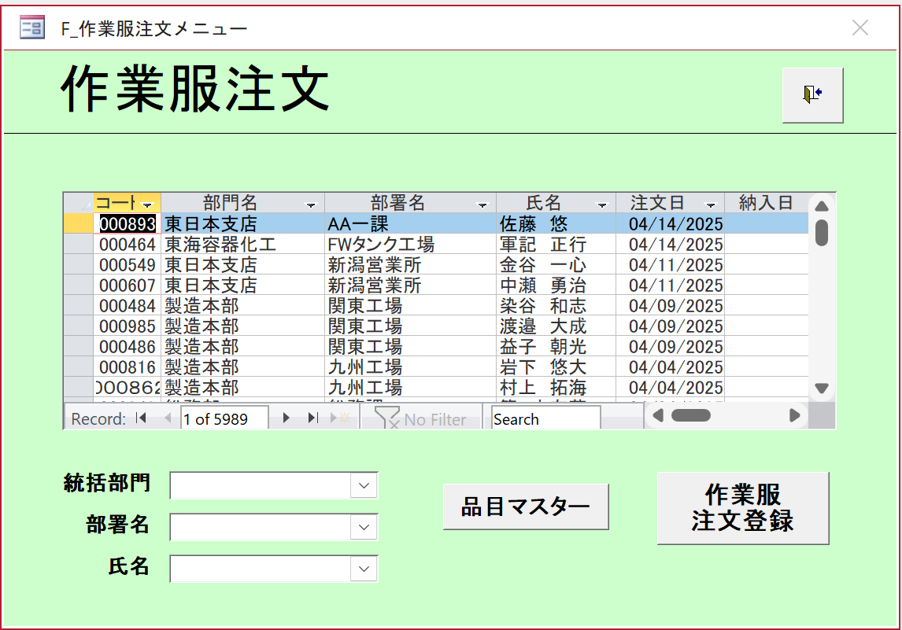

# Work Uniform Order Screen Specification
**Version:** v0.1  
**Last Updated:** 2025-10-25  
**Author:** Chính  
**Reviewer:** [PM/Leader Name]  
**System:** HR Management  

---

## 1. Overview
Screen for displaying and managing employee work uniform orders.  
Provides search, display and management functions for work uniform orders.

- **Screen endpoint:** `/work-uniform/orders`
- **Background color:** Light green (#90EE90), main display area white

## Wireframe


---

## 2. API Endpoints
| API Name | Endpoint | Purpose |
|----------|-----------|-----------|
| Work Uniform Order | `/api/v1/work-uniform-orders` | CRUD work uniform orders |
| Employee Master | `/api/v1/employees` | Get employee information |
| Department | `/api/v1/departments` | Get department list |
| Item Master | `/api/v1/items` | Get work uniform product list |

---

## 3. Initial Display
1. Display work uniform order list with pagination
2. Set default search conditions:
   - Supervising Department: Not selected
   - Department Name: Not selected
   - Employee Name: Not selected
3. Display information: Order Code, Department, Employee Name, Order Date, Delivery Date
4. Current record: 1 of 5989 (can scroll through records)

---

## 4. Search Filters

### 4.1. Supervising Department
- **API:** `GET /api/v1/departments/divisions`  
- **Purpose:** Get supervising department list  
- **Response:** `Array<Division>`

```typescript
interface Division {
  divisionId: number;
  divisionName: string;
}
```

### 4.2. Department Name
- **API:** `GET /api/v1/departments/by-division/{divisionId}`

```typescript
interface Department {
  departmentId: number;
  departmentName: string;
  divisionId: number;
}
```

### 4.3. Employee Name
- **Type:** Text input with autocomplete
- **Purpose:** Search by employee name
- **API:** `GET /api/v1/employees?search={name}`

---

## 5. Execute Search
**API:** `GET /api/v1/work-uniform-orders`

```typescript
interface WorkUniformOrderSearchParams {
  divisionName?: string;
  departmentName?: string;
  employeeName?: string;
  orderDateFrom?: string;
  orderDateTo?: string;
  deliveryDateFrom?: string;
  deliveryDateTo?: string;
  page?: number;
  size?: number;
  sort?: string;
}
```

- Display work uniform order list in table format
- Has pagination, scrolling, sorting and multi-selection

---

## 6. Display Work Uniform Order List

### 6.1. Table Structure
- **コート (Order Code):** Unique identifier for the order
- **部門名 (Department Name):** Supervising department name
- **部署名 (Section Name):** Specific section name
- **氏名 (Employee Name):** Name of employee who placed the order
- **注文日 (Order Date):** Order creation date (YYYY/MM/DD)
- **納入日 (Delivery Date):** Expected delivery date (YYYY/MM/DD)

### 6.2. Display Data
```typescript
interface WorkUniformOrder {
  orderCode: string;
  divisionName: string;
  departmentName: string;
  employeeName: string;
  orderDate: string;
  deliveryDate?: string;
  status: 'pending' | 'confirmed' | 'delivered' | 'cancelled';
  totalAmount: number;
  items: WorkUniformItem[];
  createdAt: string;
  updatedAt: string;
}

interface WorkUniformItem {
  itemCode: string;
  itemName: string;
  size: string;
  color: string;
  quantity: number;
  unitPrice: number;
  totalPrice: number;
}
```

---

## 7. Business Functions

### 7.1. Record Navigation
- **First Record:** Go to first record
- **Previous Record:** Go to previous record
- **Next Record:** Go to next record
- **Last Record:** Go to last record
- **Record Counter:** Display "Record: X of Y"

### 7.2. Search and Filter
- **Search Input:** Quick search in the list
- **No Filter:** Clear all filters
- **Filter Dropdowns:** Filter by department and employee name

### 7.3. Order Management
1. **品目マスター (Item Master):** Manage work uniform product catalog
2. **作業服注文登録 (Work Uniform Order Registration):** Create new order

---

## 8. User Operation Flow

### 8.1. View Order List
1. Open screen → display work uniform order list
2. Use record navigation to view orders
3. Use filters to search for specific orders

### 8.2. Create New Order
1. Click "作業服注文登録" → navigate to order creation screen
2. Select employee and work uniform products
3. Enter order information and save

### 8.3. Manage Products
1. Click "品目マスター" → navigate to product management screen
2. Add/edit/delete work uniform products

---

## 9. Detailed API Endpoints

### 9.1. Get Work Uniform Order List
- **API Call:** `GET /api/v1/work-uniform-orders`
- **Response Data Type:**
```typescript
interface WorkUniformOrderListResponse {
  success: true;
  data: WorkUniformOrder[];
  message: "Work uniform order list retrieved successfully";
  pagination: {
    page: number;
    size: number;
    totalElements: number;
    totalPages: number;
    hasNext: boolean;
    hasPrevious: boolean;
  };
}
```

### 9.2. Create New Work Uniform Order
- **API Call:** `POST /api/v1/work-uniform-orders`
- **Request Data Type:**
```typescript
interface CreateWorkUniformOrderRequest {
  employeeCode: string;
  orderDate: string;
  deliveryDate?: string;
  items: {
    itemCode: string;
    size: string;
    color: string;
    quantity: number;
  }[];
  remarks?: string;
}
```

### 9.3. Update Work Uniform Order
- **API Call:** `PUT /api/v1/work-uniform-orders/{orderCode}`
- **Request Data Type:**
```typescript
interface UpdateWorkUniformOrderRequest {
  deliveryDate?: string;
  status: 'pending' | 'confirmed' | 'delivered' | 'cancelled';
  items: {
    itemCode: string;
    size: string;
    color: string;
    quantity: number;
  }[];
  remarks?: string;
}
```

### 9.4. Get Product List
- **API Call:** `GET /api/v1/items`
- **Response Data Type:**
```typescript
interface Item {
  itemCode: string;
  itemName: string;
  category: string;
  availableSizes: string[];
  availableColors: string[];
  unitPrice: number;
  isActive: boolean;
}
```

---

## 10. Error Handling
| Error Code | Cause | Display |
|------------|-------|---------|
| 400 | Invalid data | "Invalid input data" |
| 404 | Order not found | "Work uniform order not found" |
| 409 | Order already exists | "Order code already exists" |
| 500 | System error | "System error. Please try again" |

---

## 11. Responsive Design & Accessibility
- Auto-scale according to screen width
- Support keyboard navigation, screen readers
- Colors ensure color-blind users can distinguish
- Scrollbar for long lists

---

## 12. Performance Optimization & Cache
- Cache supervising department list (rarely changes)
- Cache product list for 1 hour
- Support lazy loading and efficient pagination
- Lazy loading for order list

---

## 13. Environment & Technical Requirements
| Item | Value |
|------|-------|
| Framework | React + TypeScript |
| CSS | TailwindCSS |
| Supported Browsers | Chrome 120+, Edge 120+ |
| Language | Vietnamese (UTF-8) |

---

## 14. Testing & Validation
| Item | Condition | Expected Result |
|------|-----------|-----------------|
| Search by department | Select specific department | Display correct orders for that department |
| Search by employee name | Enter employee name | Display orders for that employee |
| Record navigation | Click Previous/Next | Navigate to correct record |
| Create new order | Enter complete information | Create successfully and display in list |

---

*This document is used for development and maintenance of the HR Management System*
