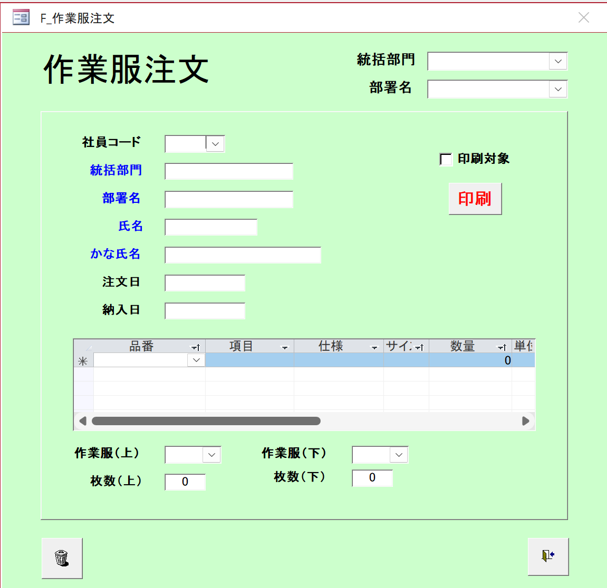

# Work Uniform Order Registration Screen Specification
**Version:** v0.1  
**Last Updated:** 2025-10-25  
**Author:** Chính  
**Reviewer:** [PM/Leader Name]  
**System:** HR Management  

---

## 1. Overview
Screen for registering work uniform orders for employees (作業服注文登録).  
Provides functionality to create, edit and manage detailed work uniform orders.

- **Screen endpoint:** `/work-uniform/order-registration`
- **Background color:** Light green (#90EE90), red border

## Wireframe


---

## 2. API Endpoints
| API Name | Endpoint | Purpose |
|----------|-----------|-----------|
| Work Uniform Order | `/api/v1/work-uniform-orders` | CRUD work uniform orders |
| Employee Master | `/api/v1/employees` | Get employee information |
| Department | `/api/v1/departments` | Get department list |
| Item Master | `/api/v1/items` | Get work uniform product list |

---

## 3. Initial Display
1. **Employee Information:** All fields empty
2. **Order Information:** Order date = current date, delivery date empty
3. **Order Details Table:** One empty row with (*) to add new
4. **Quantity Summary:** All = 0
5. **Print Options:** Not selected

---

## 4. Screen Structure

### 4.1. Top Section - Department Selection
- **統括部門 (Supervising Department)**
  - **Type:** Dropdown
  - **Purpose:** Filter subordinate departments
  - **API:** `GET /api/v1/departments/divisions`

- **部署名 (Department Name)**
  - **Type:** Dropdown
  - **Purpose:** Select specific department
  - **API:** `GET /api/v1/departments/by-division/{divisionId}`

### 4.2. Left Section - Employee and Order Information

#### 4.2.1. Employee Information
- **社員コード (Employee Code)**
  - **Type:** Dropdown with autocomplete
  - **Required:** Yes
  - **API:** `GET /api/v1/employees?search={code}`

- **統括部門 (Supervising Department)**
  - **Type:** Text input (read-only)
  - **Description:** Auto-filled when employee is selected

- **部署名 (Department Name)**
  - **Type:** Text input (read-only)
  - **Description:** Auto-filled when employee is selected

- **氏名 (Full Name)**
  - **Type:** Text input (read-only)
  - **Description:** Auto-filled when employee is selected

- **かな氏名 (Furigana Name)**
  - **Type:** Text input (read-only)
  - **Description:** Auto-filled when employee is selected

#### 4.2.2. Order Information
- **注文日 (Order Date)**
  - **Type:** Date picker
  - **Required:** Yes
  - **Default:** Current date

- **納入日 (Delivery Date)**
  - **Type:** Date picker
  - **Required:** No
  - **Validation:** Must be after order date

### 4.3. Right Section - Print Options
- **印刷対象 (Print Target)**
  - **Type:** Checkbox
  - **Description:** Mark order for printing

- **印刷 (Print)**
  - **Type:** Button (red color)
  - **Description:** Print work uniform order
  - **Validation:** Must have at least 1 product

### 4.4. Middle Section - Order Details Table

#### 4.4.1. Table Structure
- **品番 (Product Code)**
  - **Type:** Dropdown
  - **Required:** Yes
  - **API:** `GET /api/v1/items`

- **項目 (Product Name)**
  - **Type:** Text display
  - **Description:** Auto-filled when product code is selected

- **仕様 (Specifications)**
  - **Type:** Text display
  - **Description:** Auto-filled when product code is selected

- **サイズ (Size)**
  - **Type:** Dropdown
  - **Required:** Yes
  - **Description:** Available sizes for selected product

- **数量 (Quantity)**
  - **Type:** Number input
  - **Required:** Yes
  - **Default:** 0
  - **Validation:** > 0

- **単位 (Unit)**
  - **Type:** Text display
  - **Description:** Auto-filled when product code is selected

#### 4.4.2. Table Functions
- **Add new row:** (*) at beginning of row
- **Delete row:** Trash icon at end of row
- **Auto calculate totals:** Update quantity summary

### 4.5. Bottom Section - Quantity Summary

#### 4.5.1. Top Uniform
- **作業服(上) (Work Uniform Top)**
  - **Type:** Dropdown
  - **Description:** Select top uniform type

- **枚数(上) (Top Quantity)**
  - **Type:** Number input (read-only)
  - **Description:** Auto-calculated from detail table

#### 4.5.2. Bottom Uniform
- **作業服(下) (Work Uniform Bottom)**
  - **Type:** Dropdown
  - **Description:** Select bottom uniform type

- **枚数(下) (Bottom Quantity)**
  - **Type:** Number input (read-only)
  - **Description:** Auto-calculated from detail table

### 4.6. Bottom Section - Control Buttons
- **Delete (Trash icon)**
  - **Type:** Icon button
  - **Description:** Delete current order
  - **Validation:** Confirm before deletion

- **Save (Save icon)**
  - **Type:** Icon button
  - **Description:** Save work uniform order
  - **Validation:** Check required data

---

## 5. Process Flow

### 5.1. Create New Order
1. Select supervising department → update subordinate department list
2. Select subordinate department → update employee list
3. Select employee → auto-fill employee information
4. Enter delivery date (optional)
5. Add products to detail table
6. Click "Save" to create order

### 5.2. Edit Order
1. Load current order information
2. Edit necessary fields
3. Add/edit/delete products in detail table
4. Click "Save" to update

### 5.3. Print Order
1. Check "印刷対象" checkbox
2. Click "印刷" button (red)
3. System generates PDF and displays

---

## 6. Detailed API Endpoints

### 6.1. Get Employee Information
- **API Call:** `GET /api/v1/employees/{employeeCode}`
- **Response Data Type:**
```typescript
interface EmployeeInfo {
  employeeCode: string;
  fullName: string;
  kanaName: string;
  divisionName: string;
  departmentName: string;
}
```

### 6.2. Get Product List
- **API Call:** `GET /api/v1/items`
- **Response Data Type:**
```typescript
interface Item {
  itemCode: string;
  itemName: string;
  specifications: string;
  availableSizes: string[];
  unit: string;
  unitPrice: number;
}
```

### 6.3. Create Work Uniform Order
- **API Call:** `POST /api/v1/work-uniform-orders`
- **Request Data Type:**
```typescript
interface CreateWorkUniformOrderRequest {
  employeeCode: string;
  orderDate: string;
  deliveryDate?: string;
  items: {
    itemCode: string;
    size: string;
    quantity: number;
  }[];
  isPrintTarget: boolean;
}
```

### 6.4. Update Work Uniform Order
- **API Call:** `PUT /api/v1/work-uniform-orders/{orderCode}`
- **Request Data Type:**
```typescript
interface UpdateWorkUniformOrderRequest {
  deliveryDate?: string;
  items: {
    itemCode: string;
    size: string;
    quantity: number;
  }[];
  isPrintTarget: boolean;
}
```

---

## 7. Validation Rules

### 7.1. Required Data
- Employee code
- Order date
- At least 1 product in detail table
- Each product must have: product code, size, quantity > 0

### 7.2. Validation Logic
- Delivery date must be after order date
- Quantity must be > 0
- Product code must exist in system
- Size must be available for selected product

---

## 8. Error Handling
| Error Code | Cause | Display |
|------------|-------|---------|
| 400 | Invalid data | "Invalid input data" |
| 404 | Employee not found | "Employee not found" |
| 404 | Product not found | "Product not found" |
| 500 | System error | "System error. Please try again" |

---

## 9. Responsive Design & Accessibility
- Auto-scale according to screen width
- Support keyboard navigation
- Colors ensure color-blind users can distinguish
- Scrollbar for long detail table

---

## 10. Performance Optimization & Cache
- Cache department list (rarely changes)
- Cache product list for 1 hour
- Lazy loading for employee list
- Debounce for autocomplete

---

## 11. Environment & Technical Requirements
| Item | Value |
|------|-------|
| Framework | React + TypeScript |
| CSS | TailwindCSS |
| Supported Browsers | Chrome 120+, Edge 120+ |
| Language | Vietnamese (UTF-8) |

---

## 12. Testing & Validation
| Item | Condition | Expected Result |
|------|-----------|-----------------|
| Create new order | Enter complete required information | Create successfully |
| Date validation | Delivery date before order date | Show validation error |
| Add product | Select product code and size | Auto-fill product information |
| Calculate totals | Add/edit/delete products | Auto-update quantity summary |

---

*This document is used for development and maintenance of the HR Management System*
