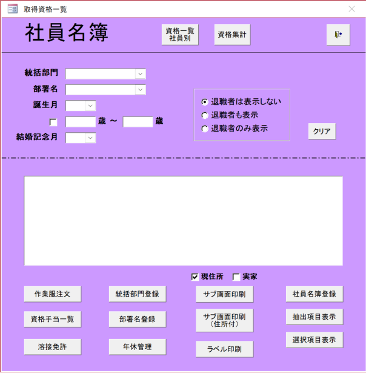

# 社員名簿画面仕様書
**バージョン:** v0.1  
**最終更新日:** 2025-10-25  
**作成者:** Chinh  
**レビュー担当:** [PM/Leader Name]  
**システム:** 人事管理システム  

---

## 1. 概要
社員の基本情報を一覧表示・管理する画面です。  
社員情報の検索、表示、印刷機能を提供します。

- **画面エンドポイント:** `/employee/roster`
- **背景色:** 紫色（#8B5CF6）、白いメイン表示エリア

## ワイヤーフレーム


---

## 2. API エンドポイント
| API名 | エンドポイント | 目的 |
|-------|----------------|------|
| Employee Master | `/api/v1/employees` | 社員一覧取得 |
| Department | `/api/v1/departments` | 部署一覧取得 |
| Qualification | `/api/v1/qualifications` | 資格一覧取得 |
| Annual Leave | `/api/v1/annual-leaves` | 年休情報取得 |

---

## 3. 初期表示
1. ボタンを無効化：「サブ画面印刷」、「サブ画面印刷 (住所付)」、「ラベル印刷」  
2. デフォルト検索条件の設定：
   - 統括部門：未選択  
   - 部署名：未選択  
   - 誕生月：未選択  
   - 年齢範囲：未選択  
   - 結婚記念月：未選択  
   - 退職者表示：表示しない  
3. 住所表示オプション：
   - 現住所：チェック済み  
   - 実家：未チェック  
4. 社員名簿エリア：空

---

## 4. 検索フィルター
### 4.1. 統括部門
- **API:** `GET /api/v1/departments/divisions`  
- **目的:** 統括部門一覧取得  
- **Response:** `Array<Division>`

```typescript
interface Division {
  divisionId: number;
  divisionName: string;
}
```

### 4.2. 部署名
- **API:** `GET /api/v1/departments/by-division/{divisionId}`

```typescript
interface Department {
  departmentId: number;
  departmentName: string;
  divisionId: number;
}
```

### 4.3. 誕生月 / 結婚記念月フィルター
- 1月～12月の選択肢を提供  
- 該当月の社員を表示

### 4.4. 年齢範囲フィルター
- チェックボックスで有効/無効を切り替え  
- 選択した年齢範囲内の社員のみを表示

### 4.5. 退職者表示
```typescript
type RetirementStatus = 'active' | 'retired' | 'all';
```
- `active`: 退職者は表示しない  
- `all`: 全て表示  
- `retired`: 退職者のみ表示

---

## 5. 検索実行
**API:** `GET /api/v1/employees`

```typescript
interface EmployeeSearchParams {
  divisionName?: string;
  departmentName?: string;
  isRetired?: boolean;
  search?: string;
  page?: number;
  size?: number;
  sort?: string;
  birthMonth?: number;
  ageFrom?: number;
  ageTo?: number;
  ageFilterEnabled?: boolean;
  weddingAnniversaryMonth?: number;
  retirementStatus?: 'active' | 'all' | 'retired';
}
```

- 社員一覧をテーブル形式で表示  
- ページネーション、スクロール、ソート、複数選択に対応

---

## 6. 業務機能
1. **作業服注文:** 注文画面に遷移、`employeeCode`を渡す  
2. **資格手当一覧:** 対応する画面に遷移  
3. **溶接免許:** 溶接免許一覧に遷移  
4. **統括部門 / 部署名登録:** 登録ページに遷移  
5. **年休管理:** `/api/v1/employees/{employeeCode}/annual-leave`を呼び出し  
6. **一覧印刷:** PDF出力、印刷前にダイアログで確認  
7. **ラベル印刷:** 社員選択必須（≥1人）、未選択時は警告表示  

---

## 7. ユーザー操作フロー
1. 画面を開く → デフォルトフィルターを初期化  
2. 統括部門を選択 → 部署名を更新  
3. その他の検索条件を設定 → 「検索」を押下  
4. システムが社員一覧を表示  
5. ユーザーが社員を選択して：
   - 一覧印刷 / ラベル印刷  
   - 年休情報を表示  
   - 関連画面に遷移

---

## 8. エラーハンドリング
| エラーコード | 原因 | 表示 |
|-------------|------|------|
| 400 | 無効なデータ | 「入力データが無効です」 |
| 404 | データが見つからない | 「データが見つかりません」 |
| 500 | システムエラー | 「システムエラーです。再試行してください」 |

---

## 9. レスポンシブデザイン & アクセシビリティ
- 画面幅に応じて自動スケール  
- キーボードナビゲーション、スクリーンリーダーに対応  
- 色覚異常者でも色を区別できるよう配慮  

---

## 10. パフォーマンス最適化 & キャッシュ
- 統括部門一覧をキャッシュ（変更頻度が低い）  
- 社員情報を5分間キャッシュ  
- 遅延読み込みと効率的なページネーションに対応  

---

## 11. 環境 & 技術要件
| 項目 | 値 |
|------|-----|
| フレームワーク | React + TypeScript |
| CSS | TailwindCSS |
| 対応ブラウザ | Chrome 120+, Edge 120+ |
| 言語 | 日本語 (UTF-8) |

---

## 12. テスト & 検証
| 項目 | 条件 | 期待結果 |
|------|------|----------|
| 誕生月検索 | 5月を選択 | 5月生まれの社員を正しく表示 |
| 年齢フィルター | 25–35歳 | 範囲外を除外 |
| 選択なしでラベル印刷 | 社員未選択 | 警告を表示 |
| 部署キャッシュ | 5分以内に画面再表示 | 部署データをキャッシュから読み込み |

---

*この文書は人事管理システム（HR Management System）の開発・保守に使用されます*
