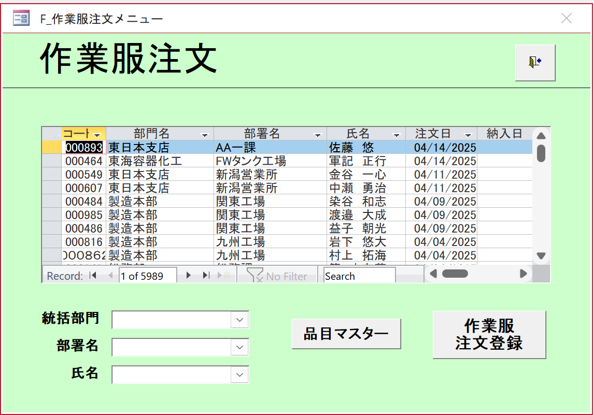

# 作業服注文画面仕様書
**バージョン:** v0.1  
**最終更新:** 2025-10-25  
**作成者:** Chính  
**レビュー担当:** [PM/Leader Name]  
**システム:** 人事管理  

---

## 1. 概要
社員の作業服注文を表示・管理する画面。  
作業服注文の検索、表示、管理機能を提供します。

- **画面エンドポイント:** `/work-uniform/orders`
- **背景色:** 薄緑 (#90EE90)、メイン表示エリア白

## ワイヤーフレーム


---

## 2. APIエンドポイント
| API名 | エンドポイント | 目的 |
|-------|----------------|------|
| 作業服注文 | `/api/v1/work-uniform-orders` | 作業服注文のCRUD |
| 社員マスタ | `/api/v1/employees` | 社員情報取得 |
| 部署 | `/api/v1/departments` | 部署リスト取得 |
| 品目マスタ | `/api/v1/items` | 作業服商品リスト取得 |

---

## 3. 初期表示
1. ページネーション付きで作業服注文リストを表示
2. デフォルト検索条件を設定:
   - 統括部門: 未選択
   - 部署名: 未選択
   - 氏名: 未選択
3. 情報表示: 注文コード、部署、社員名、注文日、納入日
4. 現在のレコード: 1 of 5989（レコード間をスクロール可能）

---

## 4. 検索フィルター

### 4.1. 統括部門
- **API:** `GET /api/v1/departments/divisions`  
- **目的:** 統括部門リストを取得  
- **Response:** `Array<Division>`

```typescript
interface Division {
  divisionId: number;
  divisionName: string;
}
```

### 4.2. 部署名
- **API:** `GET /api/v1/departments/by-division/{divisionId}`

```typescript
interface Department {
  departmentId: number;
  departmentName: string;
  divisionId: number;
}
```

### 4.3. 氏名
- **タイプ:** オートコンプリート付きテキスト入力
- **目的:** 社員名で検索
- **API:** `GET /api/v1/employees?search={name}`

---

## 5. 検索実行
**API:** `GET /api/v1/work-uniform-orders`

```typescript
interface WorkUniformOrderSearchParams {
  divisionName?: string;
  departmentName?: string;
  employeeName?: string;
  orderDateFrom?: string;
  orderDateTo?: string;
  deliveryDateFrom?: string;
  deliveryDateTo?: string;
  page?: number;
  size?: number;
  sort?: string;
}
```

- 作業服注文リストをテーブル形式で表示
- ページネーション、スクロール、ソート、複数選択機能あり

---

## 6. 作業服注文リスト表示

### 6.1. テーブル構造
- **コート (注文コード):** 注文の一意識別子
- **部門名 (部署名):** 統括部門名
- **部署名 (セクション名):** 具体的なセクション名
- **氏名 (社員名):** 注文した社員の名前
- **注文日 (注文日):** 注文作成日（YYYY/MM/DD）
- **納入日 (納入日):** 予定納入日（YYYY/MM/DD）

### 6.2. 表示データ
```typescript
interface WorkUniformOrder {
  orderCode: string;
  divisionName: string;
  departmentName: string;
  employeeName: string;
  orderDate: string;
  deliveryDate?: string;
  status: 'pending' | 'confirmed' | 'delivered' | 'cancelled';
  totalAmount: number;
  items: WorkUniformItem[];
  createdAt: string;
  updatedAt: string;
}

interface WorkUniformItem {
  itemCode: string;
  itemName: string;
  size: string;
  color: string;
  quantity: number;
  unitPrice: number;
  totalPrice: number;
}
```

---

## 7. 業務機能

### 7.1. レコードナビゲーション
- **First Record:** 最初のレコードに移動
- **Previous Record:** 前のレコードに移動
- **Next Record:** 次のレコードに移動
- **Last Record:** 最後のレコードに移動
- **Record Counter:** "Record: X of Y"を表示

### 7.2. 検索・フィルター
- **Search Input:** リスト内のクイック検索
- **No Filter:** すべてのフィルターをクリア
- **Filter Dropdowns:** 部署と社員名でフィルター

### 7.3. 注文管理
1. **品目マスター (品目マスタ):** 作業服商品カタログ管理
2. **作業服注文登録 (作業服注文登録):** 新規注文作成

---

## 8. ユーザー操作フロー

### 8.1. 注文リスト表示
1. 画面を開く → 作業服注文リストを表示
2. レコードナビゲーションを使用して注文を表示
3. フィルターを使用して特定の注文を検索

### 8.2. 新規注文作成
1. "作業服注文登録"をクリック → 注文作成画面に移動
2. 社員と作業服商品を選択
3. 注文情報を入力して保存

### 8.3. 商品管理
1. "品目マスター"をクリック → 商品管理画面に移動
2. 作業服商品の追加/編集/削除

---

## 9. 詳細APIエンドポイント

### 9.1. 作業服注文リスト取得
- **API Call:** `GET /api/v1/work-uniform-orders`
- **Response Data Type:**
```typescript
interface WorkUniformOrderListResponse {
  success: true;
  data: WorkUniformOrder[];
  message: "作業服注文リストの取得に成功しました";
  pagination: {
    page: number;
    size: number;
    totalElements: number;
    totalPages: number;
    hasNext: boolean;
    hasPrevious: boolean;
  };
}
```

### 9.2. 新規作業服注文作成
- **API Call:** `POST /api/v1/work-uniform-orders`
- **Request Data Type:**
```typescript
interface CreateWorkUniformOrderRequest {
  employeeCode: string;
  orderDate: string;
  deliveryDate?: string;
  items: {
    itemCode: string;
    size: string;
    color: string;
    quantity: number;
  }[];
  remarks?: string;
}
```

### 9.3. 作業服注文更新
- **API Call:** `PUT /api/v1/work-uniform-orders/{orderCode}`
- **Request Data Type:**
```typescript
interface UpdateWorkUniformOrderRequest {
  deliveryDate?: string;
  status: 'pending' | 'confirmed' | 'delivered' | 'cancelled';
  items: {
    itemCode: string;
    size: string;
    color: string;
    quantity: number;
  }[];
  remarks?: string;
}
```

### 9.4. 商品リスト取得
- **API Call:** `GET /api/v1/items`
- **Response Data Type:**
```typescript
interface Item {
  itemCode: string;
  itemName: string;
  category: string;
  availableSizes: string[];
  availableColors: string[];
  unitPrice: number;
  isActive: boolean;
}
```

---

## 10. エラーハンドリング
| エラーコード | 原因 | 表示 |
|-------------|------|------|
| 400 | 無効なデータ | "入力データが無効です" |
| 404 | 注文が見つからない | "作業服注文が見つかりません" |
| 409 | 注文が既に存在 | "注文コードが既に存在します" |
| 500 | システムエラー | "システムエラー。再試行してください" |

---

## 11. レスポンシブデザイン・アクセシビリティ
- 画面幅に応じて自動スケール
- キーボードナビゲーション、スクリーンリーダー対応
- 色覚障害者でも区別できる色使い
- 長いリスト用のスクロールバー

---

## 12. パフォーマンス最適化・キャッシュ
- 統括部門リストをキャッシュ（変更頻度低）
- 商品リストを1時間キャッシュ
- 遅延読み込みと効率的なページネーション対応
- 注文リストの遅延読み込み

---

## 13. 環境・技術要件
| 項目 | 値 |
|------|-----|
| フレームワーク | React + TypeScript |
| CSS | TailwindCSS |
| 対応ブラウザ | Chrome 120+, Edge 120+ |
| 言語 | 日本語 (UTF-8) |

---

## 14. テスト・検証
| 項目 | 条件 | 期待結果 |
|------|------|----------|
| 部署別検索 | 特定の部署を選択 | その部署の注文を正しく表示 |
| 社員名検索 | 社員名を入力 | その社員の注文を表示 |
| レコードナビゲーション | Previous/Nextをクリック | 正しいレコードに移動 |
| 新規注文作成 | 完全な情報を入力 | 正常に作成されリストに表示 |

---

*この文書は人事管理システム（HR Management System）の開発・保守に使用されます*
