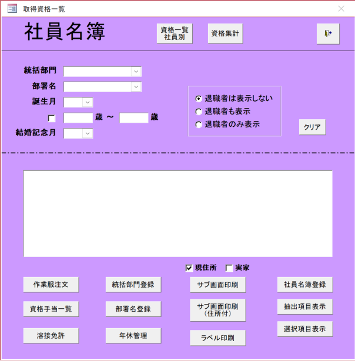

# 1. Danh Sách Nhân Viên

## Wireframe


## Tổng quan
Màn hình hiển thị và quản lý thông tin cơ bản của nhân viên. Cung cấp chức năng tìm kiếm, hiển thị và in ấn thông tin nhân viên.

## Endpoint
`/employee/roster`

## API Endpoints
- **Employee Master API**: `/api/v1/employees`
- **Department API**: `/api/v1/departments`
- **Qualification API**: `/api/v1/qualifications`
- **Annual Leave API**: `/api/v1/annual-leaves`

## Màu nền màn hình
Nền màu tím (#8B5CF6) với khu vực hiển thị chính màu trắng

## Hiển thị ban đầu
### Hiển thị màn hình
1. Vô hiệu hóa các nút sau:
   "In màn hình con", "In màn hình con (có địa chỉ)", "In nhãn"
2. Khởi tạo điều kiện tìm kiếm
   - Phòng ban giám sát: Chưa chọn
   - Tên phòng ban: Chưa chọn
   - Tháng sinh: Chưa chọn
   - Khoảng tuổi: Chưa chọn
   - Tháng kỷ niệm cưới: Chưa chọn
   - Hiển thị nhân viên nghỉ việc: Không hiển thị nhân viên nghỉ việc
3. Tùy chọn hiển thị địa chỉ
   - Địa chỉ hiện tại: Đã chọn
   - Nhà gia đình: Chưa chọn
4. Hiển thị khu vực danh sách nhân viên trống

## 1. Dropdown Phòng ban Giám sát
- **API Call**: `GET /api/v1/departments/divisions`
- Hiển thị dữ liệu lấy từ master phòng ban giám sát
- Cập nhật dropdown tên phòng ban khi được chọn
- **Response**: Danh sách phòng ban giám sát

## 2. Dropdown Tên Phòng ban
- **API Call**: `GET /api/v1/departments/by-division/{divisionId}`
- Hiển thị tên phòng ban liên kết với phòng ban giám sát đã chọn
- Hiển thị tất cả phòng ban khi phòng ban giám sát chưa được chọn
- **Response**: Danh sách phòng ban thuộc phòng ban giám sát đã chọn

## 3. Bộ lọc Tháng Sinh
- Cung cấp tùy chọn từ tháng 1 đến tháng 12
- Hiển thị chỉ nhân viên sinh trong tháng đã chọn khi được chọn

## 4. Bộ lọc Khoảng Tuổi
- Chỉ định khoảng tuổi (ví dụ: 25-35 tuổi)
- Bật/tắt với checkbox
- Loại trừ nhân viên ngoài khoảng tuổi

## 5. Bộ lọc Tháng Kỷ niệm Cưới
- Cung cấp tùy chọn từ tháng 1 đến tháng 12
- Hiển thị chỉ nhân viên có kỷ niệm cưới trong tháng đã chọn khi được chọn

## 6. Tùy chọn Hiển thị Nhân viên Nghỉ việc
- Không hiển thị nhân viên nghỉ việc (chọn mặc định)
- Cũng hiển thị nhân viên nghỉ việc
- Chỉ hiển thị nhân viên nghỉ việc

## 7. Nút Xóa
- Đặt lại tất cả điều kiện tìm kiếm về trạng thái ban đầu
- Trả về hiển thị danh sách để hiển thị tất cả bản ghi

## 8. Thực thi Tìm kiếm
- **API Call**: `GET /api/v1/employees`
- **Query Parameters**: 
  - `divisionName`: Tên phòng ban giám sát
  - `departmentName`: Tên phòng ban
  - `isRetired`: Trạng thái nghỉ việc
  - `search`: Tìm kiếm theo tên hoặc mã nhân viên
- Lấy danh sách nhân viên dựa trên điều kiện tìm kiếm đã đặt
- Hiển thị thông tin cơ bản của nhân viên đã lấy

## 9. Hiển thị Danh sách Nhân viên
### Mục hiển thị
- Mã nhân viên
- Tên
- Tên kana
- Phòng ban giám sát
- Tên phòng ban
- Ngày sinh
- Tuổi
- Địa chỉ hiện tại (tùy chọn)
- Địa chỉ nhà gia đình (tùy chọn)

### Định dạng hiển thị
- Hiển thị dạng bảng
- Danh sách có thể cuộn
- Khu vực hiển thị trắng trên nền tím

## 10. Tùy chọn Hiển thị Địa chỉ
### Địa chỉ Hiện tại
- Khi được chọn: Hiển thị địa chỉ hiện tại
- Khi không được chọn: Ẩn địa chỉ hiện tại

### Nhà Gia đình
- Khi được chọn: Hiển thị địa chỉ nhà gia đình
- Khi không được chọn: Ẩn địa chỉ nhà gia đình

## 11. Đặt hàng Đồng phục Làm việc
- Chuyển đến màn hình đặt hàng đồng phục làm việc cho nhân viên đã chọn
- Truyền mã nhân viên

## 12. Danh sách Phụ cấp Chứng chỉ
- Chuyển đến màn hình danh sách master phụ cấp chứng chỉ

## 13. Giấy phép Hàn
- Chuyển đến màn hình danh sách giấy phép hàn

## 14. Đăng ký Phòng ban Giám sát
- Chuyển đến màn hình đăng ký phòng ban giám sát

## 15. Đăng ký Tên Phòng ban
- Chuyển đến màn hình đăng ký tên phòng ban

## 16. Quản lý Nghỉ phép Năm
- Chuyển đến màn hình quản lý nghỉ phép năm

## 17. In Màn hình Con
- In danh sách hiện đang hiển thị
- Hiển thị modal xác nhận in

## 18. In Màn hình Con (có Địa chỉ)
- In danh sách bao gồm thông tin địa chỉ
- Hiển thị modal xác nhận in

## 19. In Nhãn
- In nhãn cho nhân viên đã chọn
- Cần chọn nhân viên

## 20. Đăng ký Danh sách Nhân viên
- Chuyển đến màn hình đăng ký danh sách nhân viên

## 21. Hiển thị Mục Đã Trích xuất
- Hiển thị số lượng mục được trích xuất với điều kiện tìm kiếm hiện tại
- Ví dụ: "Mục đã trích xuất: 25"

## 22. Hiển thị Mục Đã Chọn
- Hiển thị số lượng nhân viên hiện đang được chọn
- Ví dụ: "Mục đã chọn: 3"

## 23. Chọn Nhân viên
- Chọn nhân viên từ danh sách
- Hỗ trợ chọn nhiều
- Hiển thị trực quan trạng thái chọn

## 24. Chức năng In
### Modal Xác nhận In
- Hiển thị xác nhận bắt đầu in
- Cung cấp tùy chọn cài đặt in

### Đầu ra In
- Xuất định dạng PDF
- Tối ưu hóa bố cục in
- Điều chỉnh ngắt trang

## 25. Quy trình Lấy Dữ liệu
### Lấy Danh sách Nhân viên
- **API**: `GET /api/v1/employees`
- Lấy dữ liệu nhân viên dựa trên điều kiện tìm kiếm
- Hỗ trợ phân trang (`page` và `size` parameters)
- Hỗ trợ sắp xếp (`sort` parameter)

### Lấy Thông tin Nghỉ phép Năm
- **API**: `GET /api/v1/employees/{employeeCode}/annual-leave`
- Lấy chi tiết nghỉ phép năm của nhân viên
- Hỗ trợ lọc năm với `year` parameter

## 26. Xử lý Lỗi
### Lỗi Lấy Dữ liệu
- Hiển thị thông báo "Không thể lấy dữ liệu"
- Cung cấp tùy chọn thử lại

### Lỗi In
- Hiển thị thông báo "In thất bại"
- Nhắc nhở kiểm tra cài đặt in

## 27. Thiết kế Đáp ứng
- Điều chỉnh hiển thị theo kích thước màn hình
- Đảm bảo khả năng vận hành trên thiết bị di động
- Tối ưu hóa hiển thị máy tính bảng

## 28. Khả năng Truy cập
- Hỗ trợ điều hướng bàn phím
- Hỗ trợ trình đọc màn hình
- Xem xét người khiếm thị màu sắc

## 29. Tối ưu hóa Hiệu suất
- Hiển thị hiệu quả dữ liệu lớn
- Triển khai tải chậm
- Sử dụng chức năng cache

## 30. Tích hợp API Chi tiết

### 30.1. Quy trình Tải Dữ liệu Ban đầu
1. **Tải danh sách phòng ban giám sát**
   ```javascript
   GET /api/v1/departments/divisions
   ```
2. **Tải danh sách nhân viên có bộ lọc**
   ```javascript
   GET /api/v1/employees?page=1&size=20&isRetired=false
   ```

### 30.2. Quy trình Tìm kiếm/Bộ lọc
1. **Khi phòng ban giám sát thay đổi**
   ```javascript
   GET /api/v1/departments/by-division/{divisionId}
   ```
2. **Khi thực thi tìm kiếm**
   ```javascript
   GET /api/v1/employees?divisionName={name}&departmentName={name}&search={keyword}
   ```

### 30.3. Quy trình In
1. **Lấy dữ liệu in**
   ```javascript
   GET /api/v1/employees/{employeeCode}/annual-leave
   ```

### 30.4. Xử lý Lỗi API
- **400 Bad Request**: Hiển thị thông báo lỗi xác thực
- **404 Not Found**: Hiển thị "Không tìm thấy dữ liệu"
- **500 Internal Server Error**: Hiển thị "Lỗi hệ thống. Vui lòng thử lại"

### 30.5. Chiến lược Cache
- Cache danh sách phòng ban giám sát (tần suất thay đổi thấp)
- Cache phòng ban theo phòng ban giám sát
- Cache thông tin nhân viên trong 5 phút

---

*Tài liệu này được sử dụng cho phát triển và bảo trì Hệ thống Quản lý Nhân viên*
