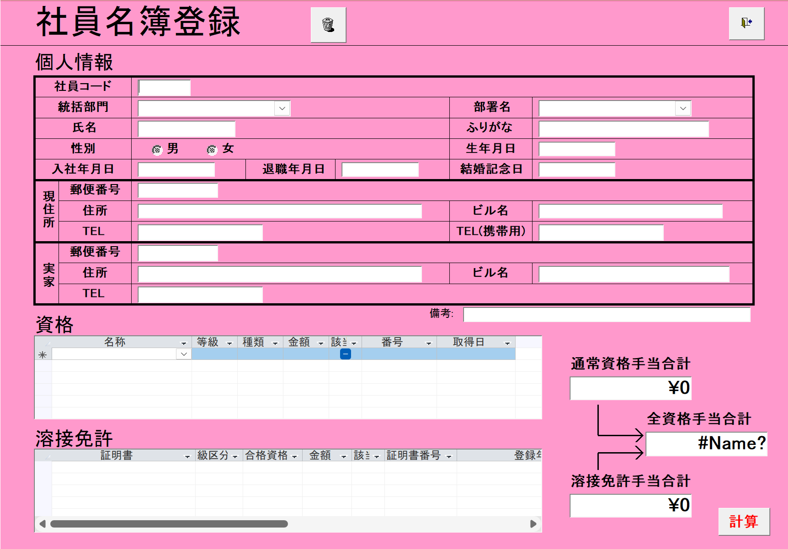

# Tài liệu Đặc tả Màn hình Đăng Ký Danh Sách Nhân Viên
**Phiên bản:** v0.1  
**Ngày cập nhật:** 2025-10-25  
**Người biên soạn:** Chính  
**Người kiểm duyệt:** [PM/Leader Name]  
**Hệ thống:** Quản lý Nhân sự  

---

## 1. Tổng quan
Màn hình **Đăng Ký Danh Sách Nhân Viên** (社員名簿登録) được sử dụng để nhập, chỉnh sửa và quản lý thông tin chi tiết của nhân viên, bao gồm thông tin cá nhân, địa chỉ, bằng cấp và giấy phép hàn.

- **Endpoint màn hình:** `/employee/registration`
- **Màu nền:** Tím (#8B5CF6), khu vực hiển thị chính màu trắng

## Wireframe


---

## 2. API Endpoints
| Tên API | Endpoint | Mục đích |
|----------|-----------|-----------|
| Employee Master | `/api/v1/employees` | CRUD nhân viên |
| Department | `/api/v1/departments` | Lấy danh sách phòng ban |
| Qualification | `/api/v1/qualifications` | Lấy danh sách chứng chỉ |
| Welding License | `/api/v1/welding-licenses` | Lấy danh sách giấy phép hàn |

### 2.1. Lấy thông tin nhân viên
- **API Call:** `GET /api/v1/employees/{employeeCode}`
- **Response Data Type:**
```typescript
interface EmployeeDetail {
  employeeCode: string;
  fullName: string;
  kanaName?: string;
  divisionName: string;
  departmentName: string;
  gender: string;
  dateOfBirth: string;
  hireDate: string;
  resignationDate?: string;
  weddingAnniversary?: string;
  currentAddress?: {
    postalCode?: string;
    address?: string;
    buildingName?: string;
    phone?: string;
    mobilePhone?: string;
  };
  familyAddress?: {
    postalCode?: string;
    address?: string;
    buildingName?: string;
    phone?: string;
  };
  remarks?: string;
  qualifications: Qualification[];
  weldingLicenses: WeldingLicense[];
}
```

### 2.2. Lưu thông tin nhân viên
- **API Call:** `PUT /api/v1/employees/{employeeCode}`
- **Request Data Type:**
```typescript
interface EmployeeUpdateRequest {
  fullName: string;
  kanaName?: string;
  divisionName: string;
  departmentName: string;
  gender: string;
  dateOfBirth: string;
  hireDate: string;
  resignationDate?: string;
  weddingAnniversary?: string;
  currentAddress?: {
    postalCode?: string;
    address?: string;
    buildingName?: string;
    phone?: string;
    mobilePhone?: string;
  };
  familyAddress?: {
    postalCode?: string;
    address?: string;
    buildingName?: string;
    phone?: string;
  };
  remarks?: string;
  qualifications: Qualification[];
  weldingLicenses: WeldingLicense[];
}
```

### 2.3. Lấy danh sách phòng ban
- **API Call:** `GET /api/v1/departments`
- **Response Data Type:**
```typescript
interface Department {
  divisionId: number;
  divisionName: string;
  departmentId: string;
  departmentName: string;
}
```

### 2.4. Lấy danh sách bằng cấp
- **API Call:** `GET /api/v1/qualifications`
- **Response Data Type:**
```typescript
interface QualificationMaster {
  qualificationId: number;
  name: string;
  grade: string;
  type: string;
  allowanceAmount: number;
}
```

---

## 3. Cấu trúc màn hình

### 1. Thông tin cá nhân (個人情報)

#### 1.1. Thông tin cơ bản
- **社員コード (Mã nhân viên)**
  - **Loại:** Text input
  - **Bắt buộc:** Có
  - **Mô tả:** Mã định danh duy nhất của nhân viên
  - **DB Mapping:** `T_社員マスタ.社員コード`

- **統括部門 (Phòng ban giám sát)**
  - **Loại:** Dropdown
  - **Bắt buộc:** Có
  - **Mô tả:** Phòng ban quản lý cấp cao
  - **DB Mapping:** `T_統括部門.統括部門` qua `T_社員マスタ.部門名`

- **部署名 (Tên phòng ban)**
  - **Loại:** Dropdown
  - **Bắt buộc:** Có
  - **Mô tả:** Tên phòng ban cụ thể
  - **DB Mapping:** `T_部署名.部署名` qua `T_社員マスタ.部署名`

- **氏名 (Họ và tên)**
  - **Loại:** Text input
  - **Bắt buộc:** Có
  - **Mô tả:** Họ và tên đầy đủ của nhân viên
  - **DB Mapping:** `T_社員マスタ.氏名`

- **ふりがな (Furigana)**
  - **Loại:** Text input
  - **Bắt buộc:** Không
  - **Mô tả:** Tên nhân viên bằng Hiragana/Katakana
  - **DB Mapping:** `T_社員マスタ.かな氏名`

- **性別 (Giới tính)**
  - **Loại:** Radio button
  - **Tùy chọn:** 男 (Nam), 女 (Nữ)
  - **Bắt buộc:** Có
  - **DB Mapping:** `T_社員マスタ.性別`

- **生年月日 (Ngày sinh)**
  - **Loại:** Date picker
  - **Bắt buộc:** Có
  - **Mô tả:** Ngày tháng năm sinh
  - **DB Mapping:** `T_社員マスタ.生年月日`

- **入社年月日 (Ngày vào công ty)**
  - **Loại:** Date picker
  - **Bắt buộc:** Có
  - **Mô tả:** Ngày bắt đầu làm việc
  - **DB Mapping:** `T_社員マスタ.入社年月日`

- **退職年月日 (Ngày nghỉ việc)**
  - **Loại:** Date picker
  - **Bắt buộc:** Không
  - **Mô tả:** Ngày chính thức nghỉ việc
  - **DB Mapping:** `T_社員マスタ.退職年月日`

- **結婚記念日 (Ngày kỷ niệm cưới)**
  - **Loại:** Date picker
  - **Bắt buộc:** Không
  - **Mô tả:** Ngày kỷ niệm cưới
  - **DB Mapping:** `T_社員マスタ.結婚記念日`

#### 1.2. Địa chỉ hiện tại (現住所)
- **郵便番号 (Mã bưu điện)**
  - **Loại:** Text input
  - **DB Mapping:** `T_社員マスタ.郵便番号1`

- **住所 (Địa chỉ)**
  - **Loại:** Text input
  - **DB Mapping:** `T_社員マスタ.住所1`

- **ビル名 (Tên tòa nhà)**
  - **Loại:** Text input
  - **DB Mapping:** `T_社員マスタ.ビル名1`

- **TEL (Số điện thoại)**
  - **Loại:** Text input
  - **DB Mapping:** `T_社員マスタ.TEL1`

- **TEL(携帯用) (Số điện thoại di động)**
  - **Loại:** Text input
  - **DB Mapping:** `T_社員マスタ.TEL携帯用`

#### 1.3. Địa chỉ nhà riêng (実家)
- **郵便番号 (Mã bưu điện)**
  - **Loại:** Text input
  - **DB Mapping:** `T_社員マスタ.郵便番号2`

- **住所 (Địa chỉ)**
  - **Loại:** Text input
  - **DB Mapping:** `T_社員マスタ.住所2`

- **ビル名 (Tên tòa nhà)**
  - **Loại:** Text input
  - **DB Mapping:** `T_社員マスタ.ビル名2`

- **TEL (Số điện thoại)**
  - **Loại:** Text input
  - **DB Mapping:** `T_社員マスタ.TEL2`

#### 1.4. Ghi chú (備考)
- **Loại:** Textarea
- **Mô tả:** Trường ghi chú chung
- **DB Mapping:** `T_社員マスタ.備考`

---

### 2. Bằng cấp (資格)

#### 2.1. Bảng quản lý bằng cấp
**Cấu trúc bảng:**
- **名称 (Tên bằng cấp)**
  - **Loại:** Dropdown
  - **DB Mapping:** `T_資格手当.名称` qua `T_資格.資格ID`

- **等級 (Cấp bậc)**
  - **Loại:** Text display
  - **DB Mapping:** `T_資格手当.等級`

- **種類 (Loại)**
  - **Loại:** Text display
  - **DB Mapping:** `T_資格手当.種類`

- **金額 (Số tiền phụ cấp)**
  - **Loại:** Number display
  - **DB Mapping:** `T_資格手当.金額`

- **該 (Áp dụng)**
  - **Loại:** Checkbox
  - **DB Mapping:** `T_資格.チェック`

- **番号 (Số chứng chỉ)**
  - **Loại:** Text input
  - **DB Mapping:** `T_資格.番号`

- **取得日 (Ngày cấp)**
  - **Loại:** Date picker
  - **DB Mapping:** `T_資格.取得日`

#### 2.2. Chức năng bảng
- **Thêm dòng mới:** Nút "+" để thêm bằng cấp mới
- **Xóa dòng:** Nút "-" để xóa bằng cấp
- **Tự động tính toán:** Cập nhật tổng phụ cấp khi thay đổi

---

### 3. Giấy phép hàn (溶接免許)

#### 3.1. Bảng quản lý giấy phép hàn
**Cấu trúc bảng:**
- **証明書 (Chứng chỉ)**
  - **Loại:** Dropdown
  - **DB Mapping:** `T_溶接免許.証明書`

- **級区分 (Phân loại cấp)**
  - **Loại:** Text display
  - **DB Mapping:** `T_溶接免許.級区分`

- **合格資格 (Bằng cấp đạt được)**
  - **Loại:** Text display
  - **DB Mapping:** `T_溶接免許.合格資格`

- **金額 (Số tiền phụ cấp)**
  - **Loại:** Number display
  - **DB Mapping:** `T_溶接免許.金額`

- **該 (Áp dụng)**
  - **Loại:** Checkbox
  - **DB Mapping:** `T_溶接免許.チェック`

- **証明書番号 (Số chứng chỉ)**
  - **Loại:** Text input
  - **DB Mapping:** `T_溶接免許.証明書番号`

- **登録 (Ngày đăng ký)**
  - **Loại:** Date picker
  - **DB Mapping:** `T_溶接免許.登録年月日`

#### 3.2. Chức năng bảng
- **Thêm dòng mới:** Nút "+" để thêm giấy phép mới
- **Xóa dòng:** Nút "-" để xóa giấy phép
- **Tự động tính toán:** Cập nhật tổng phụ cấp khi thay đổi

---

### 4. Tổng hợp phụ cấp (Phía bên phải)

#### 4.1. Hiển thị tổng phụ cấp
- **通常資格手当合計 (Tổng phụ cấp bằng cấp thông thường)**
  - **Loại:** Read-only field
  - **Giá trị mặc định:** ¥0
  - **Mô tả:** Tổng phụ cấp từ các bằng cấp thông thường

- **全資格手当合計 (Tổng phụ cấp tất cả bằng cấp)**
  - **Loại:** Read-only field
  - **Giá trị mặc định:** ¥0
  - **Mô tả:** Tổng phụ cấp từ tất cả các loại bằng cấp

- **溶接免許手当合計 (Tổng phụ cấp giấy phép hàn)**
  - **Loại:** Read-only field
  - **Giá trị mặc định:** ¥0
  - **Mô tả:** Tổng phụ cấp từ các giấy phép hàn

#### 4.2. Nút chức năng
- **計算 (Tính toán)**
  - **Loại:** Button
  - **Chức năng:** Tính toán lại tất cả các tổng phụ cấp
  - **Trigger:** Khi nhấn nút hoặc thay đổi dữ liệu

---

## Chức năng chung

### 1. Nút điều hướng
- **Lưu (保存)**
  - **Chức năng:** Lưu thông tin nhân viên
  - **Validation:** Kiểm tra dữ liệu bắt buộc trước khi lưu

- **Hủy (キャンセル)**
  - **Chức năng:** Hủy thao tác và quay lại màn hình trước

- **Xóa (削除)**
  - **Loại:** Icon thùng rác
  - **Chức năng:** Xóa nhân viên (cần xác nhận)

### 2. Validation
- **Dữ liệu bắt buộc:** Kiểm tra các trường bắt buộc
- **Format dữ liệu:** Kiểm tra định dạng ngày tháng, số điện thoại
- **Tính duy nhất:** Kiểm tra mã nhân viên không trùng lặp

### 3. Tính toán tự động
- **Phụ cấp bằng cấp:** Tự động tính khi thêm/sửa/xóa bằng cấp
- **Phụ cấp giấy phép hàn:** Tự động tính khi thêm/sửa/xóa giấy phép
- **Tổng phụ cấp:** Cập nhật tổng phụ cấp cuối cùng

---

## 4. Luồng xử lý

### 4.1. Tạo nhân viên mới
1. Nhập thông tin cá nhân cơ bản
2. Chọn phòng ban từ dropdown
3. Nhập địa chỉ (nếu cần)
4. Thêm bằng cấp (nếu có)
5. Thêm giấy phép hàn (nếu có)
6. Nhấn "Lưu" để tạo mới

### 4.2. Chỉnh sửa nhân viên
1. Tải thông tin nhân viên hiện tại
2. Chỉnh sửa các trường cần thiết
3. Cập nhật bằng cấp/giấy phép
4. Nhấn "Lưu" để cập nhật

### 4.3. Xóa nhân viên
1. Nhấn icon thùng rác
2. Xác nhận việc xóa
3. Thực hiện xóa (soft delete)

---

## 5. Xử lý Lỗi
| Mã lỗi | Nguyên nhân | Hiển thị |
|--------|--------------|-----------|
| 400 | Dữ liệu không hợp lệ | "Dữ liệu nhập không hợp lệ" |
| 404 | Không tìm thấy dữ liệu | "Không tìm thấy dữ liệu" |
| 500 | Lỗi hệ thống | "Lỗi hệ thống. Vui lòng thử lại" |

---

## 6. Thiết kế Đáp ứng & Truy cập
- Tự co giãn theo độ rộng màn hình
- Hỗ trợ điều hướng bàn phím, trình đọc màn hình
- Màu sắc đảm bảo người khiếm thị màu có thể phân biệt

---

## 7. Tối ưu hóa Hiệu suất & Cache
- Cache danh sách phòng ban (ít thay đổi)
- Cache danh sách bằng cấp trong 5 phút
- Hỗ trợ tải chậm và validation hiệu quả

---

## 8. Môi trường & Yêu cầu Kỹ thuật
| Hạng mục | Giá trị |
|----------|---------|
| Framework | React + TypeScript |
| CSS | TailwindCSS |
| Trình duyệt hỗ trợ | Chrome 120+, Edge 120+ |
| Ngôn ngữ | Tiếng Việt (UTF-8) |

---

## 9. Kiểm thử và Xác nhận
| Hạng mục | Điều kiện | Kết quả mong đợi |
|-----------|------------|-----------------|
| Tạo nhân viên mới | Nhập đầy đủ thông tin bắt buộc | Tạo thành công |
| Validation dữ liệu | Nhập sai format ngày tháng | Hiển thị lỗi validation |
| Tính toán phụ cấp | Thêm/sửa/xóa bằng cấp | Tự động cập nhật tổng phụ cấp |
| Cache phòng ban | Mở lại màn hình trong 5 phút | Dữ liệu phòng ban được tải từ cache |

---

*Tài liệu này được sử dụng cho phát triển và bảo trì Hệ thống Quản lý Nhân viên (HR Management System)*
