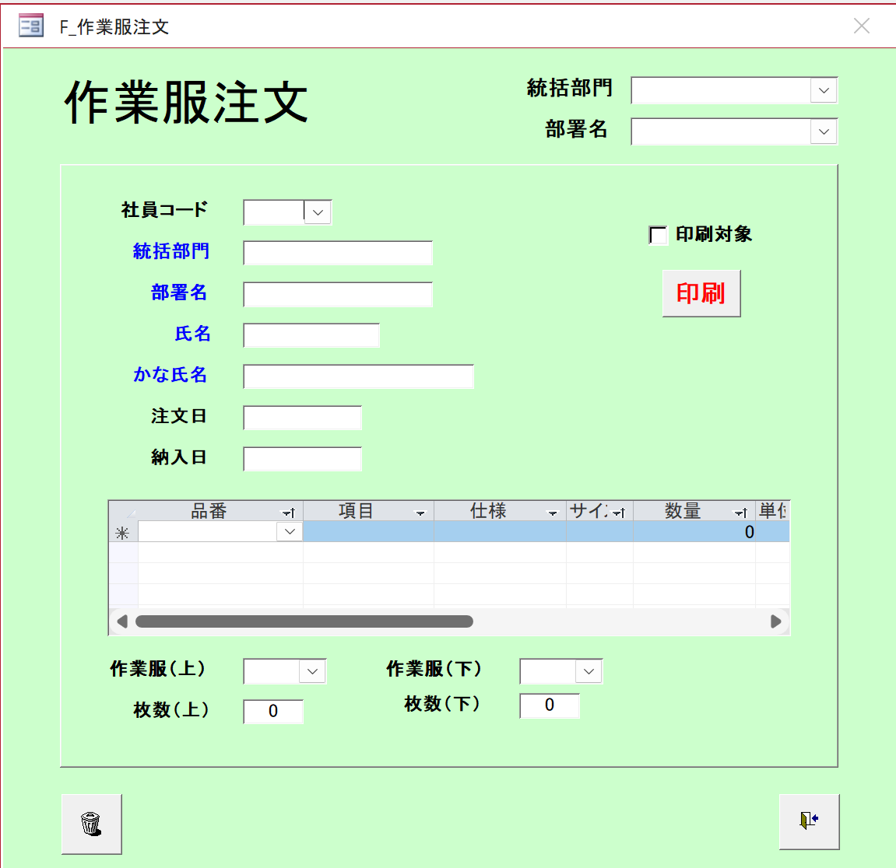

# Tài liệu Đặc tả Màn hình Đăng Ký Đặt Hàng Đồng Phục
**Phiên bản:** v0.1  
**Ngày cập nhật:** 2025-10-25  
**Người biên soạn:** Chính  
**Người kiểm duyệt:** [PM/Leader Name]  
**Hệ thống:** Quản lý Nhân sự  

---

## 1. Tổng quan
Màn hình đăng ký đặt hàng đồng phục cho nhân viên (作業服注文登録).  
Cung cấp chức năng tạo, chỉnh sửa và quản lý đơn đặt hàng đồng phục chi tiết.

- **Endpoint màn hình:** `/work-uniform/order-registration`
- **Màu nền:** Xanh lá nhạt (#90EE90), viền đỏ

## Wireframe


---

## 2. API Endpoints
| Tên API | Endpoint | Mục đích |
|----------|-----------|-----------|
| Work Uniform Order | `/api/v1/work-uniform-orders` | CRUD đơn đặt hàng đồng phục |
| Employee Master | `/api/v1/employees` | Lấy thông tin nhân viên |
| Department | `/api/v1/departments` | Lấy danh sách phòng ban |
| Item Master | `/api/v1/items` | Lấy danh sách sản phẩm đồng phục |

---

## 3. Hiển thị ban đầu
1. **Thông tin nhân viên:** Tất cả các trường trống
2. **Thông tin đơn hàng:** Ngày đặt hàng = ngày hiện tại, ngày giao hàng trống
3. **Bảng chi tiết đơn hàng:** Một dòng trống với dấu (*) để thêm mới
4. **Tóm tắt số lượng:** Tất cả = 0
5. **Tùy chọn in:** Chưa chọn

---

## 4. Cấu trúc màn hình

### 4.1. Phần trên - Lựa chọn Phòng ban
- **統括部門 (Phòng ban giám sát)**
  - **Loại:** Dropdown
  - **Mục đích:** Lọc danh sách phòng ban con
  - **API:** `GET /api/v1/departments/divisions`

- **部署名 (Tên phòng ban)**
  - **Loại:** Dropdown
  - **Mục đích:** Chọn phòng ban cụ thể
  - **API:** `GET /api/v1/departments/by-division/{divisionId}`

### 4.2. Phần trái - Thông tin Nhân viên và Đơn hàng

#### 4.2.1. Thông tin Nhân viên
- **社員コード (Mã nhân viên)**
  - **Loại:** Dropdown với autocomplete
  - **Bắt buộc:** Có
  - **API:** `GET /api/v1/employees?search={code}`

- **統括部門 (Phòng ban giám sát)**
  - **Loại:** Text input (read-only)
  - **Mô tả:** Tự động điền khi chọn nhân viên

- **部署名 (Tên phòng ban)**
  - **Loại:** Text input (read-only)
  - **Mô tả:** Tự động điền khi chọn nhân viên

- **氏名 (Họ tên)**
  - **Loại:** Text input (read-only)
  - **Mô tả:** Tự động điền khi chọn nhân viên

- **かな氏名 (Tên Furigana)**
  - **Loại:** Text input (read-only)
  - **Mô tả:** Tự động điền khi chọn nhân viên

#### 4.2.2. Thông tin Đơn hàng
- **注文日 (Ngày đặt hàng)**
  - **Loại:** Date picker
  - **Bắt buộc:** Có
  - **Mặc định:** Ngày hiện tại

- **納入日 (Ngày giao hàng)**
  - **Loại:** Date picker
  - **Bắt buộc:** Không
  - **Validation:** Phải sau ngày đặt hàng

### 4.3. Phần phải - Tùy chọn In ấn
- **印刷対象 (Đối tượng in)**
  - **Loại:** Checkbox
  - **Mô tả:** Đánh dấu đơn hàng để in

- **印刷 (In)**
  - **Loại:** Button (màu đỏ)
  - **Mô tả:** In đơn đặt hàng
  - **Validation:** Phải có ít nhất 1 sản phẩm

### 4.4. Phần giữa - Bảng Chi tiết Đơn hàng

#### 4.4.1. Cấu trúc bảng
- **品番 (Mã sản phẩm)**
  - **Loại:** Dropdown
  - **Bắt buộc:** Có
  - **API:** `GET /api/v1/items`

- **項目 (Tên sản phẩm)**
  - **Loại:** Text display
  - **Mô tả:** Tự động điền khi chọn mã sản phẩm

- **仕様 (Thông số kỹ thuật)**
  - **Loại:** Text display
  - **Mô tả:** Tự động điền khi chọn mã sản phẩm

- **サイズ (Kích thước)**
  - **Loại:** Dropdown
  - **Bắt buộc:** Có
  - **Mô tả:** Danh sách kích thước có sẵn của sản phẩm

- **数量 (Số lượng)**
  - **Loại:** Number input
  - **Bắt buộc:** Có
  - **Mặc định:** 0
  - **Validation:** > 0

- **単位 (Đơn vị)**
  - **Loại:** Text display
  - **Mô tả:** Tự động điền khi chọn mã sản phẩm

#### 4.4.2. Chức năng bảng
- **Thêm dòng mới:** Dấu (*) ở đầu dòng
- **Xóa dòng:** Icon thùng rác ở cuối dòng
- **Tự động tính tổng:** Cập nhật tóm tắt số lượng

### 4.5. Phần dưới - Tóm tắt Số lượng

#### 4.5.1. Đồng phục trên
- **作業服(上) (Đồng phục trên)**
  - **Loại:** Dropdown
  - **Mô tả:** Chọn loại đồng phục trên

- **枚数(上) (Số lượng trên)**
  - **Loại:** Number input (read-only)
  - **Mô tả:** Tự động tính từ bảng chi tiết

#### 4.5.2. Đồng phục dưới
- **作業服(下) (Đồng phục dưới)**
  - **Loại:** Dropdown
  - **Mô tả:** Chọn loại đồng phục dưới

- **枚数(下) (Số lượng dưới)**
  - **Loại:** Number input (read-only)
  - **Mô tả:** Tự động tính từ bảng chi tiết

### 4.6. Phần dưới cùng - Nút điều khiển
- **Xóa (Trash icon)**
  - **Loại:** Icon button
  - **Mô tả:** Xóa đơn hàng hiện tại
  - **Validation:** Xác nhận trước khi xóa

- **Lưu (Save icon)**
  - **Loại:** Icon button
  - **Mô tả:** Lưu đơn đặt hàng
  - **Validation:** Kiểm tra dữ liệu bắt buộc

---

## 5. Luồng xử lý

### 5.1. Tạo đơn hàng mới
1. Chọn phòng ban giám sát → cập nhật danh sách phòng ban con
2. Chọn phòng ban con → cập nhật danh sách nhân viên
3. Chọn nhân viên → tự động điền thông tin nhân viên
4. Nhập ngày giao hàng (tùy chọn)
5. Thêm sản phẩm vào bảng chi tiết
6. Nhấn "Lưu" để tạo đơn hàng

### 5.2. Chỉnh sửa đơn hàng
1. Tải thông tin đơn hàng hiện tại
2. Chỉnh sửa các trường cần thiết
3. Thêm/sửa/xóa sản phẩm trong bảng chi tiết
4. Nhấn "Lưu" để cập nhật

### 5.3. In đơn hàng
1. Đánh dấu checkbox "印刷対象"
2. Nhấn nút "印刷" (màu đỏ)
3. Hệ thống tạo file PDF và hiển thị

---

## 6. API Endpoints Chi tiết

### 6.1. Lấy thông tin nhân viên
- **API Call:** `GET /api/v1/employees/{employeeCode}`
- **Response Data Type:**
```typescript
interface EmployeeInfo {
  employeeCode: string;
  fullName: string;
  kanaName: string;
  divisionName: string;
  departmentName: string;
}
```

### 6.2. Lấy danh sách sản phẩm
- **API Call:** `GET /api/v1/items`
- **Response Data Type:**
```typescript
interface Item {
  itemCode: string;
  itemName: string;
  specifications: string;
  availableSizes: string[];
  unit: string;
  unitPrice: number;
}
```

### 6.3. Tạo đơn đặt hàng
- **API Call:** `POST /api/v1/work-uniform-orders`
- **Request Data Type:**
```typescript
interface CreateWorkUniformOrderRequest {
  employeeCode: string;
  orderDate: string;
  deliveryDate?: string;
  items: {
    itemCode: string;
    size: string;
    quantity: number;
  }[];
  isPrintTarget: boolean;
}
```

### 6.4. Cập nhật đơn đặt hàng
- **API Call:** `PUT /api/v1/work-uniform-orders/{orderCode}`
- **Request Data Type:**
```typescript
interface UpdateWorkUniformOrderRequest {
  deliveryDate?: string;
  items: {
    itemCode: string;
    size: string;
    quantity: number;
  }[];
  isPrintTarget: boolean;
}
```

---

## 7. Validation Rules

### 7.1. Dữ liệu bắt buộc
- Mã nhân viên
- Ngày đặt hàng
- Ít nhất 1 sản phẩm trong bảng chi tiết
- Mỗi sản phẩm phải có: mã sản phẩm, kích thước, số lượng > 0

### 7.2. Validation logic
- Ngày giao hàng phải sau ngày đặt hàng
- Số lượng phải > 0
- Mã sản phẩm phải tồn tại trong hệ thống
- Kích thước phải có sẵn cho sản phẩm đã chọn

---

## 8. Xử lý Lỗi
| Mã lỗi | Nguyên nhân | Hiển thị |
|--------|--------------|-----------|
| 400 | Dữ liệu không hợp lệ | "Dữ liệu nhập không hợp lệ" |
| 404 | Không tìm thấy nhân viên | "Không tìm thấy nhân viên" |
| 404 | Không tìm thấy sản phẩm | "Không tìm thấy sản phẩm" |
| 500 | Lỗi hệ thống | "Lỗi hệ thống. Vui lòng thử lại" |

---

## 9. Thiết kế Đáp ứng & Truy cập
- Tự co giãn theo độ rộng màn hình
- Hỗ trợ điều hướng bàn phím
- Màu sắc đảm bảo người khiếm thị màu có thể phân biệt
- Scrollbar cho bảng chi tiết dài

---

## 10. Tối ưu hóa Hiệu suất & Cache
- Cache danh sách phòng ban (ít thay đổi)
- Cache danh sách sản phẩm trong 1 giờ
- Lazy loading cho danh sách nhân viên
- Debounce cho autocomplete

---

## 11. Môi trường & Yêu cầu Kỹ thuật
| Hạng mục | Giá trị |
|----------|---------|
| Framework | React + TypeScript |
| CSS | TailwindCSS |
| Trình duyệt hỗ trợ | Chrome 120+, Edge 120+ |
| Ngôn ngữ | Tiếng Việt (UTF-8) |

---

## 12. Kiểm thử và Xác nhận
| Hạng mục | Điều kiện | Kết quả mong đợi |
|-----------|------------|-----------------|
| Tạo đơn hàng mới | Nhập đầy đủ thông tin bắt buộc | Tạo thành công |
| Validation ngày | Ngày giao hàng trước ngày đặt | Hiển thị lỗi validation |
| Thêm sản phẩm | Chọn mã sản phẩm và kích thước | Tự động điền thông tin sản phẩm |
| Tính tổng số lượng | Thêm/sửa/xóa sản phẩm | Tự động cập nhật tóm tắt |

---

*Tài liệu này được sử dụng cho phát triển và bảo trì Hệ thống Quản lý Nhân viên (HR Management System)*
